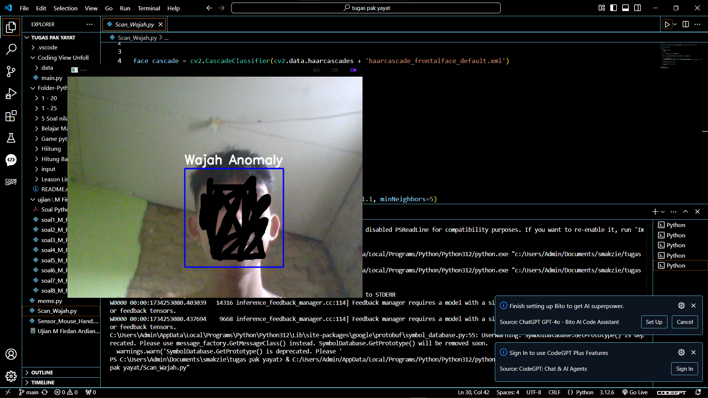
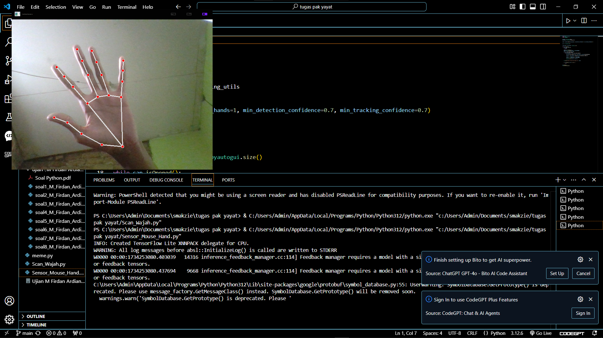

# 1. Scanner Kamera Python

Scanner Kamera Python adalah aplikasi yang dibuat untuk memanfaatkan kamera perangkat untuk memindai dokumen atau gambar. Proyek ini menggunakan Python dan beberapa pustaka seperti `OpenCV` dan `pyzbar` untuk mendeteksi dan memindai kode QR, serta fitur pengolahan gambar lainnya.



## Fitur Utama

- **Antarmuka Sederhana**: Hanya bisa mendeteksi wajah saja

# 2. Scanner Tangan dan Penggerak Kursor Python

Scanner Tangan dan Penggerak Kursor Python adalah aplikasi berbasis Python yang memungkinkan pengguna untuk menggerakkan kursor komputer menggunakan gerakan tangan. Proyek ini menggunakan teknologi pengenalan gerakan tangan untuk mendeteksi gerakan tangan dan mengontrol posisi kursor.



## Fitur Utama

- **Pemindaian Tangan**: Aplikasi mendeteksi gerakan tangan menggunakan kamera perangkat.
- **Penggerak Kursor**: Menggunakan gerakan tangan untuk menggerakkan kursor di layar.
- **Antarmuka Sederhana**: Mudah digunakan dengan sedikit interaksi selain gerakan tangan.


## Prasyarat

Pastikan Anda telah menginstal Python versi 3.x dan pustaka berikut:
- `opencv-python` untuk menangani kamera dan pengolahan gambar.
- `pyzbar` untuk pemindaian kode QR.
- `pillow` untuk pengolahan gambar jika diperlukan.

## Instalasi

Ikuti langkah-langkah di bawah ini untuk menginstal dan menjalankan aplikasi ini:

1. **Clone repositori**:
   ```bash
   git clone https://github.com/username/scanner-camera-python.git
   cd scanner-camera-python
